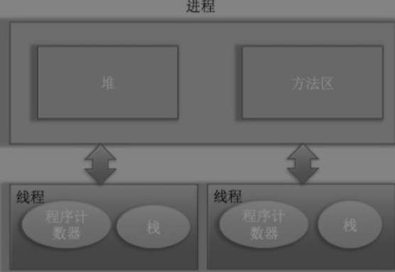

# 并发编程-线程基础

## 1.1 什么是线程

进程是代码在数据集合上的一次运行活动，是系统进行资源分配和调度的基本单位；线程则是进程的一个执行路径，一个进程中至少有一个线程，进程中的多个线程共享进程的资源。

操作系统在分配资源时是把资源分配给进程的，但CPU资源比较特殊，它是被分配到线程的，因为真正要占用CPU运行的是线程，所以也说线程是CPU分配的基本单位。

在Java中，启动main方法其实是启动了一个JVM的进程，而main方法所在的线程就是这个进程中的一个线程，也称主线程。

一个进程中有多个线程，多个线程共享进程的**堆**和**方法区**资源，但是每个线程有自己的**程序计数器**和**栈**区域。

程序计数器是一块内存区域，用来记录线程当前要执行的指令地址。那么为何要将程序计数器设计为线程私有的呢？线程是占用CPU执行的基本单位，而CPU一般是使用时间片轮转方式让线程轮询占用的，所以当前线程CPU时间片用完后，要让出CPU，等下次轮到自己的时候再执行。那么如何知道之前程序执行到哪里了呢？其实程序计数器就是为了记录该线程让出CPU时的执行地址的，待再次分配到时间片时线程就可以从自己私有的计数器指定地址继续执行。另外需要注意的是，如果执行的native方法，那么程序计数器记录的是undefined地址，只有执行的是Java代码时，程序计数器记录的才是下一条指令的地址。

另外每个线程都有自己的栈资源，用于存储该线程的局部变量，这些局部变量是该线程私有的，其他线程是访问不了的，除此之外栈还用来存放线程的调用栈帧。

堆是一个进程中最大的一块内存，堆是被进程中的所有线程所共享的，是进程创建时分配的，堆里面主要存放使用new操作符创建的对象实例。

方法区则用来存放JVM记载的类、常量和静态变量等信息，也是线程共享的。